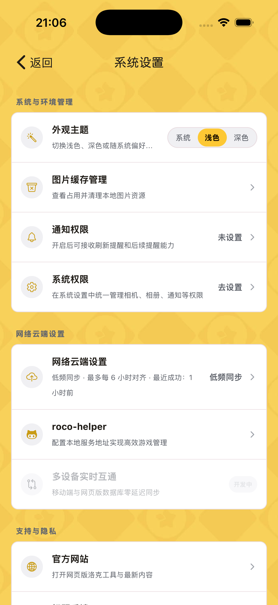
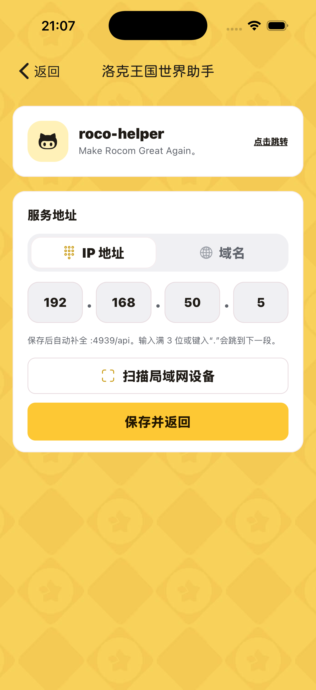
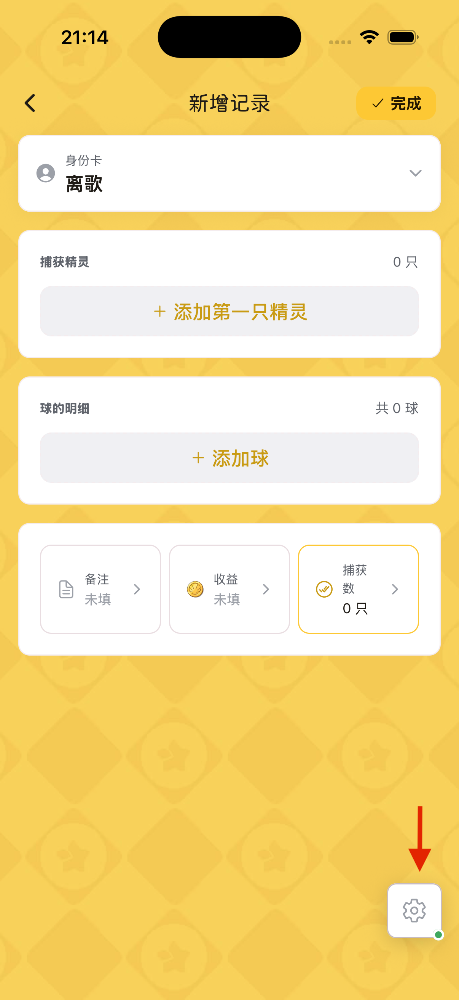

# 洛克图鉴 APP

洛克图鉴是一款面向《洛克王国：世界》玩家的图鉴应用，提供精灵、技能、蛋组等资料查询，以及异色记录和相关攻略辅助功能。

## 功能

- 精灵图鉴
- 精灵异色混刷查询
  - 自定义混刷查询
  - 赛季异色混刷快速查询
- 蛋组图鉴
- 技能图鉴
- 异色记录
  - 支持使用不同身份卡区分记录
  - 支持多设备云端同步
  - 展示已获取的赛季异色图鉴
  - 支持手动和全自动异色记录
  - 提供数据统计分析
- 远行商人
- 地图广场
  - 采矿路线
- PVP 阵容
- 配种模拟器

## 异色记录自动化配置

自动化记录功能需要配合 [roco-helper（洛克助手）](https://github.com/h3110w0r1d-y/rocom-helper) 使用。

1. 配置 `roco-helper`（洛克助手）。
2. 打开设置并点击 `roco-app`。

   

3. 配置服务地址：
   - 可手动输入洛克王国世界助手的服务端 IP 地址。
   - 如果不清楚 IP 地址，可以扫描局域网设备。应用会自动扫描当前网关下的 `4939` 端口，并查找已正确部署 `users` 接口的设备。若设备处于不同网段，请手动设置 IP 地址。

   

4. 点击新增记录，然后点击页面右下角的齿轮按钮，配置需要记录的 UID 角色。

   

   多账号场景下，请选择正确的角色，否则可能无法正确获取数据。连通后，角色以及设置齿轮会显示绿色圆点。如果开启了双牌通知、齿轮右上角会有红色圆点。
